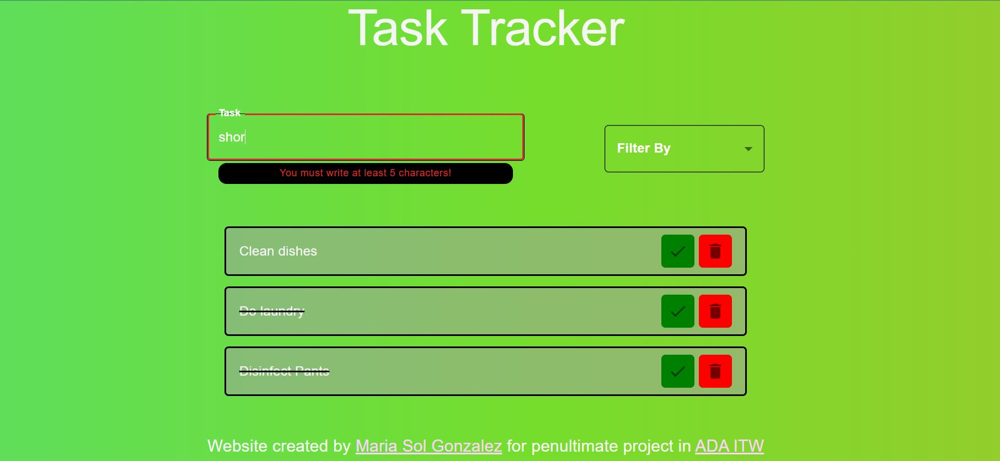

#Task Traker Project

This project is the 5th out of 6 total projects required by ADA ITW school.

#This project was based on the use of React.

* NPM
* NODE
* JSX
* HOOKS
* Props
* useState
* Utilization of the MUI library

